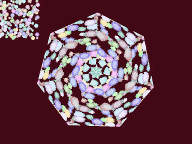

# Mangekyo
HSP3.6で動く万華鏡のサンプルです 

画面の左上に 万華鏡の元となるオブジェクトを描画し、 
それを円になるように回転させながら中央にコピーしています

 
 

© 2025 [㊥Maruchu](http://maruchu.nobody.jp/ "㊥Maruchu")

製作に使用した [HSP(Hot Soup Processor)](https://hsp.tv/ "HSP3") のバージョンは 3.6 です。

